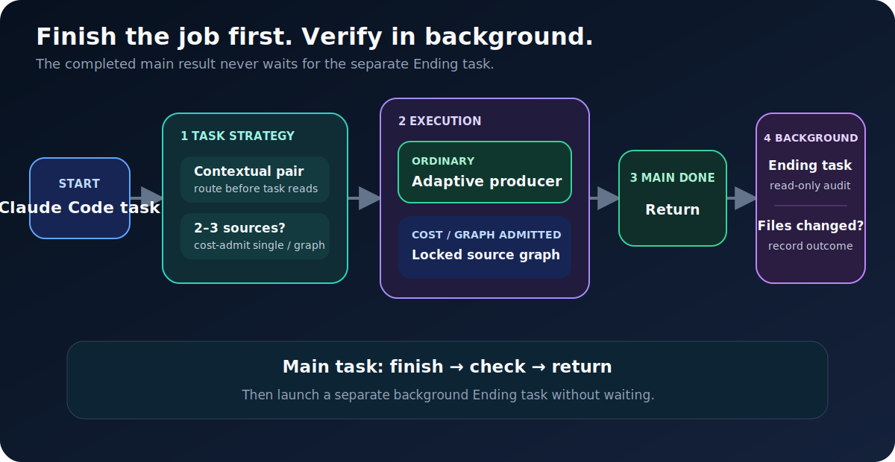
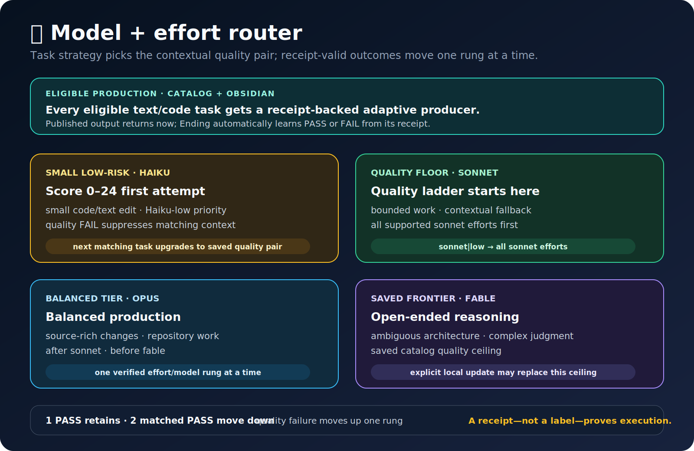

<div align="center">

# 🚀 Auto Best Model

**Claude Code-only · score every task · finish the job first · prove it with mandatory Ending tasks**

[中文说明](./README.zh.md)

Saved `haiku → sonnet → opus → fable` quality ladder · refreshed only when you request a local model update

Small low-risk edits scoring 0–24 try `haiku`-low first · larger work uses the saved quality ladder

Sibling of the Codex-only origin [`qin-codex-skills`](https://github.com/qinbatista/qin-codex-skills) (v34, 8 public skills) · this edition ports the same lifecycle to Claude Code and adds `auto-model-for-claude`

</div>

## 🔄 Core flow

<picture>
  <source media="(max-width: 600px)" srcset="./management-skill/assets/readme/core-flow-mobile.svg">
  
</picture>

## ✅ Finish first. Run mandatory real verification.

This is the lifecycle's most important structural rule, unchanged from the Codex origin:

1. **Score every submission from 0–100, then finish the requested job** and run the proportional implementation check.
2. **Return the completed result immediately.** The user is not held inside a verifier, poll loop, or repair cycle.
3. **Start one scored/model-routed `End Task-<task name>-<check>` background agent per independent real test, API check, or render.** Dependent checks stay ordered instead of being fragmented.
4. **Every Ending executes its assigned real check and all required checks must PASS.** Failure creates a Fix Task with the exact error, then a fresh End Task reruns the check, for up to three repairs.

Main work and Ending verification are deliberately different agent runs. A summary is never verification: heavy changes need real tests, API evidence, builds, renders, or visual checks appropriate to the change.

## ⚡ Models & private learning

<picture>
  <source media="(max-width: 600px)" srcset="./management-skill/assets/readme/model-router-mobile.svg">
  
</picture>

- **Cold start:** Task type and the 0–100 score select a saved `sonnet`/`opus`/`fable` quality pair; small low-risk edits scoring 0–24 try `haiku`-low first.
- **Learning:** One receipt-valid Real PASS retains the pair; two matched PASS outcomes try one weaker rung; a quality failure upgrades one rung immediately. A `haiku` quality failure suppresses `haiku` for the matching context and upgrades the next task.
- **Operational:** A zero-result failure gets one stronger fallback and is not learned as a quality failure.
- **Scheduling:** Two or three independent read-only sources are cost-admitted before reads; dependent multi-file work stays with one contextual producer.
- **Memory:** Ending outcomes update broad project/Skills **`Claude Model Switch.md`** pages; project/task/module/file/symbol are fields only -- no hierarchy notes. This page name is exclusive to this Claude Code edition and is never shared with Codex's own `Model Switch.md` learner.

## Rules

- **Producer:** Show score/band + route change. Eligible 0–24 low-risk edits try `haiku`-low; otherwise use saved pair. Two PASS descend; quality FAIL ascends.
- **Prompt:** Reusable prompts and durable AI instructions load Prompt Skill.
- **Route:** Delegate only on explicit request or current end-to-end proof.
- **Deliver:** Finish and return the completed main result before background verification.
- **Verify:** Mandatory: one scored/model-routed `End Task-<task name>-<check>` per independent check; all must PASS. FAIL → Fix Task + fresh End Task, up to three.
- **Files:** Recall project/module/file history before editing; record the verified change after.
- **Memory:** Change history is local JSONL + optional Obsidian; private learning uses broad project/Skills `Claude Model Switch.md`: fields only; no hierarchy notes.
- **Models:** Use the saved ladder; explicit model update refreshes it from Claude Code's documented aliases; eligible small edits prioritize `haiku`-low; missing cache preserves it.
- **Privacy:** Secrets, raw prompts/results, receipts, ledgers, caches, and work artifacts stay local.

## 📊 Lifecycle benchmark: upstream Codex-measured reference evidence

> **This table is not a Claude Code measurement.** It is the exact upstream benchmark from
> [`qin-codex-skills`](https://github.com/qinbatista/qin-codex-skills), measured on Codex/GPT
> models (`gpt-5.6-sol|ultra`, `gpt-5.6-terra|*`, `gpt-5.6-luna|*`), retained here as
> reference evidence for the same finish-first/background-verify lifecycle.
> **Claude Code numbers are not yet measured** -- this ported suite
> (`scripts/render_lifecycle_benchmark.py` plus its tests) exists so a real Claude Code
> cohort can be run and published later.

Both arms enter `gpt-5.6-sol | ultra`. **Without skill** finishes and stops; verification cost is **0**. **With skill** executes the task on the receipt-proven dynamic pair, returns it, then launches separate Ending verification. **Frozen evidence notice:** The table is the unchanged 2026-07-17 upstream v34 cohort. The current score-based `haiku` priority and mandatory multi-Ending/repair can change future Auto outcomes; they do not rewrite these values, the fixed Direct arm, or task-versus-task-plus-Ending accounting.


| Tier | Auto task pair (upstream) | Direct task | Auto task | Separate Ending | Auto task + check | Task savings | Whole savings |
|---|---|---:|---:|---:|---:|---:|---:|
| Simple · 4 tests | Terra-medium | 343,459 / 131.842s | 200,522 / 52.861s | 78,818 / 18.864s | 279,340 / 71.725s | **41.617% tokens / 59.906% time** | **18.669% / 45.598%** |
| Medium · 6 tests | Terra-high | 472,575 / 199.180s | 211,128 / 56.713s | 94,741 / 23.940s | 305,869 / 80.653s | **55.324% tokens / 71.527% time** | **35.276% / 59.507%** |
| Complex · 3 sources | Luna-low · one producer | 451,856 / 137.654s | 141,012 / 40.999s | 96,997 / 23.709s | 238,009 / 64.708s | **68.793% tokens / 70.216% time** | **47.326% / 52.992%** |
| **All 6 pairs** | **receipt-proven dynamic pairs** | **1,267,890 / 468.676s** | **552,662 / 150.573s** | **270,556 / 66.513s** | **823,218 / 217.086s** | **56.411% tokens / 67.873% time** | **35.072% / 53.681%** |

**Correctness (upstream run):** 12/12 exact results, all Mini Tests/gates, and 6/6 Ending audits passed, with 0 retry/fallback/repair. The common `gpt-5.6-sol|ultra` dispatcher is excluded from the requested task/check worlds but disclosed in the full report as **404,598 tokens / 361.038s**. Logical tokens are not billing tokens.

[Read the full upstream benchmark report and every run.](./management-skill/assets/readme/lifecycle-skill-benchmark.md)

## 🧩 Nine public Skills

- [`Task Analyze`](./task-analyze-skill/SKILL.md) — route strategy, benchmarks, and admission.
- [`Workflow`](./workflow-skill/SKILL.md) — admitted locked-route execution.
- [`Prompt`](./prompt-skill/SKILL.md) — reusable prompt and durable AI-instruction gate.
- [`Code`](./code-skill/SKILL.md) — Python, C#, Unity C#, and registered code domains.
- [`Project Memory`](./project-memory-skill/SKILL.md) — project/module/file recall and verified records.
- [`Verify`](./verify-skill/SKILL.md) — post-result Real Verify and regression evidence.
- [`Optimization`](./optimization-skill/SKILL.md) — stable repeated work into reusable tools.
- [`Management`](./management-skill/SKILL.md) — private profiles and public mirror management.
- [`Auto Model for Claude`](./auto-model-for-claude/SKILL.md) — pre-existing adaptive per-task model routing for delegated Agent/Workflow work.

## Install

1. Put the nine Skill folders under `~/.claude/skills/`:

```bash
git clone https://github.com/qinbatista/qin-claude-skills.git
cp -r qin-claude-skills/*-skill qin-claude-skills/auto-model-for-claude ~/.claude/skills/
```

2. Merge [`global-claude-entry-rule.md`](./task-analyze-skill/assets/global-claude-entry-rule.md) into `~/.claude/CLAUDE.md`.
3. Start Claude Code normally; the eight core skills install no hook. `auto-model-for-claude` optionally registers a `PreToolUse` hook for automatic model routing (see its own README section).

**Privacy:** The mirror excludes credentials, secrets, private ledgers, routing history, caches, raw prompts/results, receipts, and work artifacts; every publish runs a safety scan.

**Mirrors:** `qin-claude-skills` · origin: [`qin-codex-skills`](https://github.com/qinbatista/qin-codex-skills)
