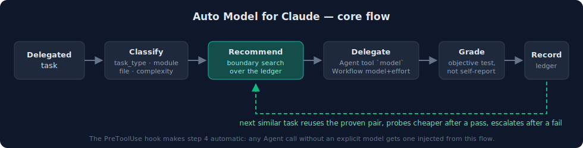
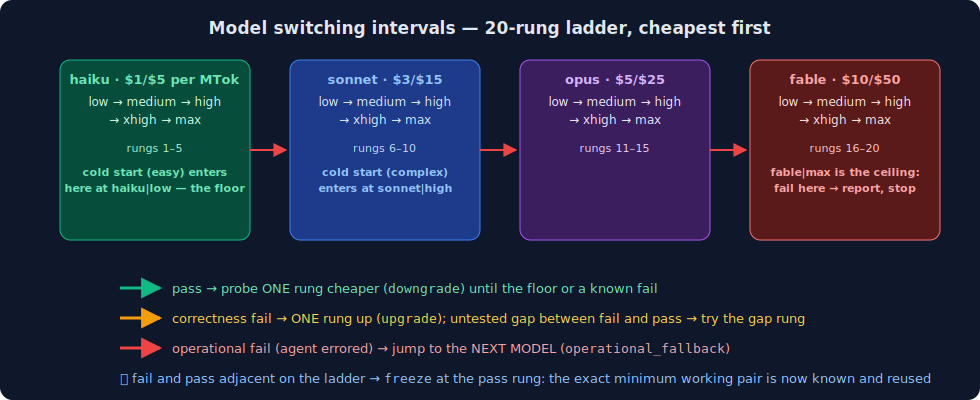

<div align="center">

# 🚀 Auto Model for Claude(Claude 自动模型路由)

**仅限 Claude Code · 委派任务的自适应按任务模型路由 · 便宜优先 + 客观判分 · 失败上调一档**

[English](./README.md)

边界搜索账本为每类任务找出真正能通过的最便宜 model+effort 组合——然后冻结并复用

当前阶梯:`haiku` → `sonnet` → `opus` → `fable` · effort `low → medium → high → xhigh → max` · 共 20 档

</div>

## 🔄 核心流程



## ⚡ 模型切换区间



完整切换区间是一条 20 档的有序阶梯(`model|effort` 组合,最便宜在前):

| 档位 | 模型 | 单价(每百万 token,输入/输出) | effort 档 |
| --- | --- | --- | --- |
| 1–5 | `haiku`(4.5) | $1 / $5 | low → medium → high → xhigh → max |
| 6–10 | `sonnet`(5) | $3 / $15 | low → medium → high → xhigh → max |
| 11–15 | `opus`(4.8) | $5 / $25 | low → medium → high → xhigh → max |
| 16–20 | `fable`(5) | $10 / $50 | low → medium → high → xhigh → max |

**进入点(冷启动,该任务类无历史):** 简单任务 → `haiku|low`(第 1 档,地板)· 复杂任务 → `sonnet|high`(第 8 档)。

**移动规则**(逐行移植 Codex 自适应学习器的 `_active_recommendation`,六个方向,词汇完全一致):

| 方向 | 触发条件 | 移动方式 |
| --- | --- | --- |
| `initial` | 该任务类没有任何历史记录 | 从冷启动档进入 |
| `downgrade`(降档) | 上次**通过**且还没到地板 | 向下试探一档(更便宜) |
| `upgrade`(升档) | **正确性**失败 | 向上一档 |
| —(间隙试探) | 已知失败档和通过档之间还有未测档 | 试第一个未测的间隙档 |
| `freeze`(冻结) | 失败档和通过档在阶梯上**相邻**,或地板档通过 | 锁定通过档;该任务类以后一律复用 |
| `operational_fallback`(运维回退) | agent **报错**(无输出——不是质量信号) | 直接跳到下一个模型的 medium 档 |
| `no_switch` | `fable\|max` 也失败(阶梯耗尽) | 停在原地,向用户报告失败,不再循环 |

作用域:历史记录按 `file` > `module` > `task_type` 的特异度匹配,不同文件/模块各自学习独立的边界。

## 🧪 当前 benchmark——有 skill 对 没 skill(真实消融)

**消融 v1** · 完全相同的提示词、不指定 `model` 参数,先卸 hook 再恢复 · **2 组任务对 · 4 次运行 · 0 重试**

> **成本降低 ≈ 90.3%** · **提速 44.7%** · 4 个结果全部正确 · 正确性门 **PASS**(双臂 2/2)

> 没装 skill 时,每个委派调用都默默跑在最贵的会话模型 `claude-fable-5` 上;装上后两个任务都路由到 `claude-haiku-4-5`(模型 ID 由子代理自报,结果由确定性脚本判分)。haiku 输入输出单价都恰好便宜 10 倍,节省比例与输入输出占比无关。若会话默认是 sonnet,同样算法约省 67–70% · 单次交替运行,非持久中位数。

[脱敏消融证据](./auto-model-for-claude/assets/ablation-with-vs-without-skill-2026-07-17.json)

## 📊 补充 A/B——便宜臂对强臂

**A/B v1** · 同提示词,`haiku|low` 对 `opus` · **3 层级 · 6+2 次运行** · 确定性脚本判分,非模型自报

> **每个路由任务省 ≈ 80%**(单价差 5 倍,token 差 ±0.7%)· **正确率:haiku 3/3 · opus 2/3**——强臂在*最简单*层级连续两次答错

> 模型价格不保证单任务正确性;由客观判分 + 边界搜索账本决定哪个模型保留哪类任务 · 复杂层便宜臂反而略差(token +5.9%)——如实报告,单次配对运行。

[脱敏 A/B 证据](./auto-model-for-claude/assets/model-routing-benchmark-2026-07-16.json) · [路由验证证据](./auto-model-for-claude/assets/verification-evidence-2026-07-16.json) · [13 项单元测试](./auto-model-for-claude/tests/test_auto_model.py)

## 规则

- **路由面:** Claude Code 没有内建自适应路由;本 skill 通过 Agent 工具的 `model` 参数和 Workflow `agent()` 的 `model`+`effort` 路由——两者都经子代理自报模型 ID 实测验证。
- **全自动:** `Agent` 工具上的 `PreToolUse` hook 会在调用方未指定模型时自动注入推荐模型;显式指定的模型绝不覆盖;hook 出错时静默放行(fail-open)。
- **判分,不轻信:** 模型标签不是执行证明;结果只有经客观验证(测试、判分器、真实输出检查)后才写入账本。
- **诚实升档:** 正确性失败上调一档;运维失败跳一个模型;`fable|max` 失败直接向用户报告,绝不死循环。
- **学习:** 每次尝试追加到私有本地账本(`local/ledger.jsonl`,已 gitignore);可选同步投影到 Obsidian 的 `Claude Model Switch` 页面。benchmark 探针**不进账本**,保证合成运行不会污染真实任务类学习。
- **隐私:** 账本、回执、个人路径、vault 内容全部留在本地;每次发布运行密钥/路径扫描,命中即拒绝推送。

## 🧩 Skill

- [`auto-model-for-claude`](./auto-model-for-claude/SKILL.md) — 路由策略、阶梯目录([`references/ladder.json`](./auto-model-for-claude/references/ladder.json))、recommend/record 命令行、PreToolUse hook、Obsidian 同步、GitHub 同步、测试。

## 安装

1. 把 skill 文件夹复制到 `~/.claude/skills/`:

```bash
git clone https://github.com/qinbatista/qin-claude-skills.git
cp -r qin-claude-skills/auto-model-for-claude ~/.claude/skills/
```

2. 在 `~/.claude/settings.json` 注册自动路由 hook(合并进你已有的 `hooks`):

```json
{
  "hooks": {
    "PreToolUse": [
      {
        "matcher": "Agent",
        "hooks": [
          {
            "type": "command",
            "command": "python3 ~/.claude/skills/auto-model-for-claude/scripts/pretooluse_agent_model.py 2>/dev/null || true",
            "timeout": 10,
            "statusMessage": "Auto-routing model..."
          }
        ]
      }
    ]
  }
}
```

3. 验证:跑单元测试套件和一次实测探针。

```bash
cd ~/.claude/skills/auto-model-for-claude && python3 -m unittest discover -s tests
python3 scripts/auto_model.py recommend --task-type smoke --complexity easy   # → haiku|low
```

可选 Obsidian 投影:`python3 scripts/sync_vault.py --vault "/你的/vault/路径"`(或设置 `CLAUDE_SKILLS_OBSIDIAN_VAULT` 环境变量)。

**隐私:** 镜像排除 `local/` 账本、缓存、回执、密钥和个人绝对路径;每次发布运行 `scripts/sync_github.py` 的安全扫描,命中任何模式即拒绝推送。

**镜像:** `qin-claude-skills` · 与 [`qin-codex-skills`](https://github.com/qinbatista/qin-codex-skills) 同族
