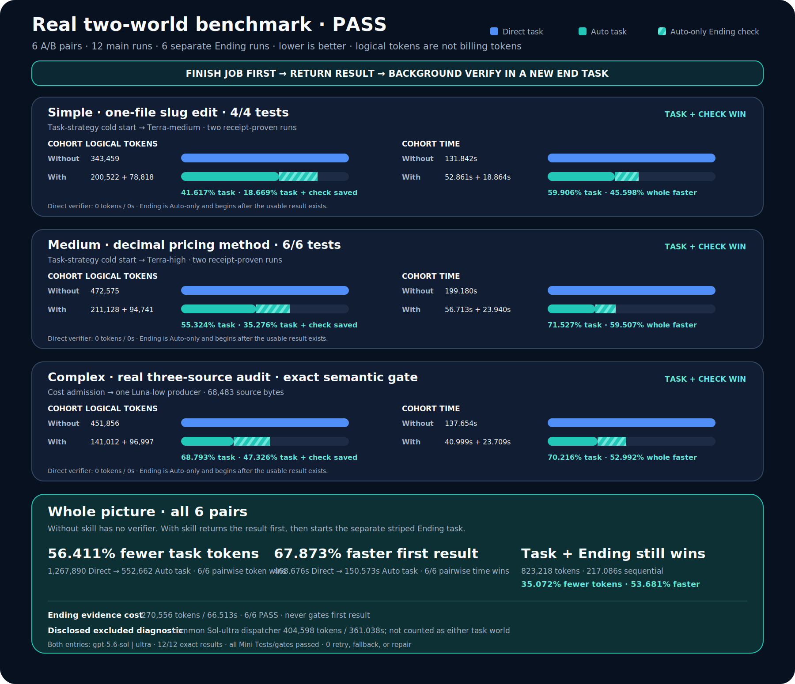

# Adaptive lifecycle benchmark v34: finish first, check later

> **Upstream reference evidence — not a Claude Code measurement.** This report and its
> underlying [`lifecycle-skill-benchmark.json`](./lifecycle-skill-benchmark.json) were
> measured upstream on Codex/GPT models (`gpt-5.6-sol|ultra`, `gpt-5.6-terra|*`,
> `gpt-5.6-luna|*`) by [`qin-codex-skills`](https://github.com/qinbatista/qin-codex-skills).
> They are retained here verbatim as historical reference evidence for the same
> finish-first/background-verify lifecycle. They are **not** Claude Code numbers and must
> not be read as such. Claude Code numbers are not yet measured; the ported benchmark
> suite in this repo (`scripts/render_lifecycle_benchmark.py` and its tests) exists so a
> real Claude Code cohort can be measured and published later.

Date: 2026-07-17 (upstream Codex measurement)  
Frozen cohort: `real-adaptive-two-world-benchmark-v34`  
Entry model in both arms: `gpt-5.6-sol | ultra`

## Technical summary

**The corrected skill now has a measurable reason to exist.** Across six real A/B pairs, the Auto result-producing task used **56.411% fewer logical tokens** and returned its usable result **67.873% faster** than the fixed Sol-ultra task. After adding all six separate Ending checks, the complete Auto world still used **35.072% fewer tokens** and **53.681% less sequential time** than Direct.

- **Correctness:** 12/12 main runs returned the exact required result; all proportional Mini Tests or semantic gates passed; 6/6 independent Ending sessions returned PASS.
- **Dynamic execution:** Auto did not keep using Sol-ultra. Simple ran on `gpt-5.6-terra | medium`, Medium on `gpt-5.6-terra | high`, Complex on `gpt-5.6-luna | low`, and Ending on `gpt-5.6-luna | low`.
- **Root cause fixed:** the old scheduler opened one session per small independent source and repeatedly paid an estimated 36,000-token session context. v34 cost-admits fan-out before source reads and chooses one contextual producer when that is cheaper.
- **Lifecycle preserved:** **finish the job first → return the result → background verify in a new `End Task-*`.** Ending is Auto-only, read-only, evidence-only, and never gates the completed main result.

> **FINISH JOB FIRST → RETURN THE COMPLETED RESULT → BACKGROUND VERIFY IN A NEW `End Task-*`**

The striped segment below belongs only to the With-skill world. Without skill finishes the task and stops, so its verifier cost is exactly **0 tokens / 0 seconds**. Each tier normalizes its own bars to Direct=100%; the exact cohort totals are printed beside them.

[Open the sanitized benchmark summary used to render the graphic.](./lifecycle-skill-benchmark.json)

## The two worlds are now defined without mixing stages

There are exactly two user-facing worlds:

1. **Without skill:** the fixed `gpt-5.6-sol | ultra` session completes the task and proportional local check, then stops. It has no Ending verifier.
2. **With skill:** the receipt-proven adaptive producer or admitted graph completes the task and proportional local check, returns the result, then a separate `gpt-5.6-luna | low` Ending session checks immutable evidence.

The With-skill world has two observable milestones, not a third world:

- **Task milestone:** cost and time when the usable result exists and can be returned.
- **Task + check milestone:** task plus the later Ending cost, shown sequentially so the total cannot be hidden. The user is not blocked for this second milestone.

The common Sol-ultra dispatch session is not a result producer and is not an Ending check, so the requested two-world score excludes it. It is still disclosed separately: **404,598 tokens / 361.038s**. If that infrastructure diagnostic is forcibly added to Auto task + Ending, the all-in total is **1,227,816 tokens / 578.124s**: **3.161% fewer tokens but 23.353% slower** than Direct. The skill therefore passes the requested task/check benchmark, while reducing dispatcher latency remains a real next optimization target.

## All three real task tiers win

| Tier | Auto task model | Without skill task | With skill task | Separate Ending | With skill task + check | Task savings | Task + check savings |
|---|---|---:|---:|---:|---:|---:|---:|
| Simple · one-file slug edit · 4 tests | Terra-medium | 343,459 / 131.842s | 200,522 / 52.861s | 78,818 / 18.864s | 279,340 / 71.725s | **41.617% tokens / 59.906% time** | **18.669% tokens / 45.598% time** |
| Medium · decimal pricing method · 6 tests | Terra-high | 472,575 / 199.180s | 211,128 / 56.713s | 94,741 / 23.940s | 305,869 / 80.653s | **55.324% tokens / 71.527% time** | **35.276% tokens / 59.507% time** |
| Complex · real three-source audit · exact semantic gate | Luna-low | 451,856 / 137.654s | 141,012 / 40.999s | 96,997 / 23.709s | 238,009 / 64.708s | **68.793% tokens / 70.216% time** | **47.326% tokens / 52.992% time** |
| **All 6 pairs** | **receipt-proven dynamic pairs** | **1,267,890 / 468.676s** | **552,662 / 150.573s** | **270,556 / 66.513s** | **823,218 / 217.086s** | **56.411% tokens / 67.873% time** | **35.072% tokens / 53.681% time** |

Every tier won task tokens, task time, aggregate task-plus-check tokens, and aggregate task-plus-check sequential time. Across individual task pairs, Auto won **6/6 token comparisons and 6/6 time comparisons**. Individual Ending variance is preserved in the run table below; it is not averaged away.

## Every measured main run and Ending run

Direct rows have no verifier. Auto whole values are exactly `task + Ending`; no controller or hidden verifier is folded into either column.

| Tier | Pair | Arm / effective task model | Task tokens | Task time | Ending tokens | Ending time | Task + Ending tokens | Sequential total | Result |
|---|---:|---|---:|---:|---:|---:|---:|---:|---|
| Simple | 1 | Direct · Sol-ultra | 144,951 | 72.498s | 0 | 0 | 144,951 | 72.498s | exact + 4/4 |
| Simple | 1 | Auto · Terra-medium | 112,539 | 31.904s | 39,443 | 9.583s | 151,982 | 41.487s | exact + 4/4; Ending PASS |
| Simple | 2 | Direct · Sol-ultra | 198,508 | 59.344s | 0 | 0 | 198,508 | 59.344s | exact + 4/4 |
| Simple | 2 | Auto · Terra-medium | 87,983 | 20.957s | 39,375 | 9.281s | 127,358 | 30.238s | exact + 4/4; Ending PASS |
| Medium | 1 | Direct · Sol-ultra | 354,993 | 127.767s | 0 | 0 | 354,993 | 127.767s | exact + 6/6 |
| Medium | 1 | Auto · Terra-high | 105,453 | 29.040s | 37,231 | 10.464s | 142,684 | 39.504s | exact + 6/6; Ending PASS |
| Medium | 2 | Direct · Sol-ultra | 117,582 | 71.413s | 0 | 0 | 117,582 | 71.413s | exact + 6/6 |
| Medium | 2 | Auto · Terra-high | 105,675 | 27.673s | 57,510 | 13.476s | 163,185 | 41.149s | exact + 6/6; Ending PASS |
| Complex | 1 | Direct · Sol-ultra | 219,633 | 83.358s | 0 | 0 | 219,633 | 83.358s | exact semantic result |
| Complex | 1 | Auto · Luna-low | 74,749 | 21.049s | 38,355 | 10.177s | 113,104 | 31.226s | exact semantic result; Ending PASS |
| Complex | 2 | Direct · Sol-ultra | 232,223 | 54.296s | 0 | 0 | 232,223 | 54.296s | exact semantic result |
| Complex | 2 | Auto · Luna-low | 66,263 | 19.950s | 58,642 | 13.532s | 124,905 | 33.482s | exact semantic result; Ending PASS |

The only individual task-plus-check token losses were Simple pair 1 (-4.851%) and Medium pair 2 (-38.784%). The corresponding cohort aggregates still won because the other repeat was substantially cheaper. This is why the report gives both per-run and aggregate evidence rather than claiming that every stochastic whole-world run must win.

## Auto now chooses, retains, upgrades, and downgrades one contextual rung at a time

Auto no longer means “always try Spark” or “always run Sol-ultra.” Its decision is scoped to the exact task profile and uses the saved Luna → Terra → Sol quality ladder:

1. **Cold start from task strategy.** Task type and complexity choose a reasonable pair, such as Terra-medium for an easy code edit or Terra-high for a complex code edit.
2. **One receipt-valid Real PASS retains the same pair.** A single stochastic success is not enough to weaken quality.
3. **Two matched Real PASS outcomes try exactly one weaker rung.** Repeated success earns a controlled downgrade, not a jump to the floor.
4. **A receipt-valid quality failure upgrades exactly one rung immediately.** The failed pair cannot remain selected.
5. **A zero-result operational failure gets one stronger fallback.** It is not learned as a quality failure.
6. **Multiple verified passing pairs are ranked like-for-like.** The same workload hash is compared by median total tokens, then process time, then the weaker rung.
7. **Spark is schedule-source-only.** It is never the ordinary first attempt and cannot override the contextual quality pair.

This state machine answers the central complaint: a successful Auto run cannot stay on Sol-ultra forever, and a failed weak model cannot keep retrying forever. It moves only when receipt-backed evidence justifies the move.

## The complex-task bug was unconditional fan-out, not model switching

The real complex fixture audits three independent source files and must return one exact JSON result. The sources total **68,483 bytes**. The new pre-read admission estimate was:

- one contextual producer: `36,000 fixed context + 17,121 estimated source tokens = 53,121 input tokens`;
- fused three-session schedule: `3 × 36,000 fixed context + 17,121 source tokens = 125,121 input tokens`.

Because one producer was estimated cheaper and the prompt did not require latency-critical parallelism, v34 selected one Luna-low producer. Larger source sets above **180,000 bytes**, or tasks that explicitly require latency-critical parallelism, may still use a cost-admitted fused graph.

The development sequence shows why this mattered:

| Version | Complex Auto structure per repeat | Direct task | Auto task | Task token result | Ending | Auto task + check | Whole token result |
|---|---|---:|---:|---:|---:|---:|---:|
| v28 | 3 Spark source sessions + Terra merge | 436,077 | 396,373 | 9.105% fewer | 90,747 | 487,120 | **11.705% more** |
| v33 | 2 Spark source sessions + fused Terra merge | 350,830 | 298,641 | 14.876% fewer | 79,978 | 378,619 | **7.921% more** |
| **v34** | **1 cost-admitted Luna producer** | **451,856** | **141,012** | **68.793% fewer** | **96,997** | **238,009** | **47.326% fewer** |

A same-task diagnostic also ran one Terra-medium producer against the v33 frozen fixture and returned the exact result in **82,684 tokens / 20.715s**, compared with the v33 scheduled mean of **149,320.5 tokens / 22.452s**. That controlled check identified repeated session context as the mechanism. The v28/v33/v34 cohort totals are separate stochastic cohorts, so they support the structural diagnosis but are not presented as a same-sample causal estimate.

## Ending is a real separate session and cannot block delivery

The lifecycle now has a strict handoff boundary:

1. The result producer owns the edit and runs only the proportional Mini Test. Light local work gets the smallest meaningful smoke test. Heavy API, large-file, side-effecting, or expensive work gets syntax/name/reference checks instead.
2. After the exact result exists, the producer builds an immutable evidence manifest that hashes the main receipt, adaptive receipt, test evidence, and result.
3. The main task presents the completed result before starting verification.
4. A persistent task is created and renamed exactly `End Task-<related task name>` when the Codex task API is available.
5. Ending executes the supplied deterministic validator command, read-only, within 60 seconds. It returns PASS or the exact recorded failure and never repairs, polls, asks questions, or makes the origin wait.

The six benchmark Ending runs are distinct runtime sessions with `session_role=separate_background_check`. All six used Luna-low and returned a deterministic four-check PASS. The current task also starts a real user-visible `End Task-*` after publication; the origin does not wait for it.

## Development failures were preserved instead of rewritten as passes

| Development version | Observed failure | Fix |
|---|---|---|
| v27 | Ending prompt omitted the exact expected test count | Put the expected check contract into immutable evidence |
| v29 | Direct exceeded the original 300s main timeout | Raise both main arms equally to 600s; keep Ending at 60s |
| v30 | Natural-language Ending reinterpreted four true facts as failure | Replace subjective reinterpretation with a fixed validator |
| v31 | Ending guessed manifest shape and an `absolute_path` field that did not exist | Validate the exact schema and real `path` field in code |
| v34 development run | Harness hard-coded Terra-medium and falsely rejected a valid Luna-low receipt | Accept the receipt-consistent dynamic pair; preserve the failed run under `development-failures/` |

No failed development run is included in the final v34 totals. The final cohort used fresh complex reruns after the harness correction; Simple and Medium reused their already complete runs from the same frozen v34 snapshot because the corrected acceptance rule did not touch those arms.

## Measurement and robustness contract

- Both arms enter on `gpt-5.6-sol | ultra`.
- Direct stays fixed, completes the exact task and proportional local check, and has no verifier.
- Auto must provide a receipt proving its actual child or graph. A configured model label is not enough.
- Task time ends when the exact completed result exists. Ending begins later and is reported separately.
- Controller diagnostics are excluded from the requested task/check worlds but published explicitly, including the forced all-in result.
- Logical tokens include cached input and are not a billing, dollar-cost, or rate-limit claim.
- Two pairs per tier are an optimization confirmation for this code-structure change, not the six-pair-per-condition threshold for durable strategy admission.
- The benchmark uses real local code edits or exact source audits, not synthetic sleep loops or estimated output tokens.

## Frozen evidence and reproducibility

| Evidence | Value |
|---|---|
| Public aggregate JSON | [`lifecycle-skill-benchmark.json`](./lifecycle-skill-benchmark.json) |
| Public aggregate SHA-256 | `7c92d6b6998b9388242665de1589305269480567d0fc9fb76cfa38b8bde6d32d` |
| Frozen snapshot manifest SHA-256 | `1e7203f32301bb5e88d99fc089846e8362dff685082b5433e6c0ceb7969e7de6` |
| Benchmark runner SHA-256 | `8b26bdbcd549cc165bd64bd599334783b7f2d94295066e7980d938efb15eb0e3` |
| Adaptive runner SHA-256 | `ed605dd28d656b2eabfdf5343c8cd1d8b9ca34f22c15d3f495c7f9626d790627` |
| Global entry policy SHA-256 | `8fdebf10a1868ff25dc2157ca4ae9681003744872ba8b45dd68b49a1dbf93502` |
| Complex expected-result SHA-256 | `a4c877ca8d531dd4410d7fe5b24b65d2d9b45be13d6eb25b300804ca69578023` |
| Local frozen cohort | `work/real-adaptive-two-world-benchmark-v34/` |

The public JSON and SVG contain no raw prompts, results, user paths, task IDs, receipts, private routing history, or secrets. Raw logs and receipt files remain local, while the public report publishes every measured run, aggregate, model pair, and disclosed exclusion needed to reproduce the calculations.

## Final publication checks

The final code, documentation, JSON, and graphic were rechecked after the report was frozen. These are real local results, not benchmark-arm self-reports:

| Validation surface | Result | Evidence |
|---|---:|---|
| Task Analyze unit/integration suite | **445/445 PASS** | Includes model selection, receipt authorization, dispatcher, source-cost admission, dynamic-rung learning, generated plans, and Workflow contracts. |
| Management/report suite | **29/29 PASS** | Includes README generation, public-data safety, JSON-to-SVG agreement, viewBox/bounds, and deterministic renderer coverage. |
| Project Memory/model-learning suite | **36/36 PASS** | Covers task-scoped history, matched PASS learning, one-rung downgrade/upgrade, and operational fallback separation. |
| Verify/Ending manifest suite | **12/12 PASS** | Covers manifest build/validate, exact schema, SHA-256 bindings, deterministic checks, and tamper rejection. |
| Prompt lifecycle suite | **9/9 PASS** | Confirms result-first delivery and that Ending audits evidence instead of silently starting prompt trials. |
| Optimization suite | **4/4 PASS** | Confirms the optimizer/verifier ownership boundary. |
| **All Python tests** | **535/535 PASS** | Six independent suites; zero failures and zero errors. |
| Task Analyze generated-plan validator | **34/34 plans + 4/4 graduated PASS** | Every registered Luna/Terra/Sol effort pair was checked for single and complex admitted plans. |
| Workflow validator | **13/13 routes + 2/2 gates + 3/3 traces + 4/4 graduated PASS** | Validates one-producer, cost-admitted graph, benchmark, and detached Ending paths. |
| Changed Python entry points | **PASS** | Eleven changed router, memory, validator, renderer, sync, and Ending scripts compiled with `py_compile`. |
| Public SVG set | **19/19 parse PASS** | `xmllint`; the benchmark SVG also regenerated byte-for-byte from the public JSON. |
| Benchmark graphic visual QA | **PASS** | Full 1800×1550 PNG inspected after regeneration; labels, bars, hatching, legends, and right edges remain visible. |

The benchmark SVG SHA-256 is `7e2c5dfeda9724355efefeb00dd7e236e6644dca95d5693c7a9cc2d5d825804c`; a fresh regeneration produced the same hash.

Publication targets are [`qin-codex-skills`](https://github.com/qinbatista/qin-codex-skills) and [`auto-best-model`](https://github.com/qinbatista/auto-best-model). Each publish runs the mirror privacy scan and remote-hash parity check. The exact publication hashes are reported in the task handoff: a Git commit cannot embed its own final hash because adding that hash changes the commit itself.

## Decision and next steps

**Keep the skill with the v34 routing and admission rules.** It now preserves correctness, selects task-appropriate models, wins result-producing task tokens and time in every measured tier, and still wins aggregate tokens/time after its separate Ending check.

The next optimization target is the Sol-ultra dispatch session, not the producer or Ending contract. Its excluded diagnostic still makes forced all-in sequential time slower. Future changes should reduce that dispatch turn without hiding it, weakening the evidence gate, or moving Ending back into the user-blocking path.
