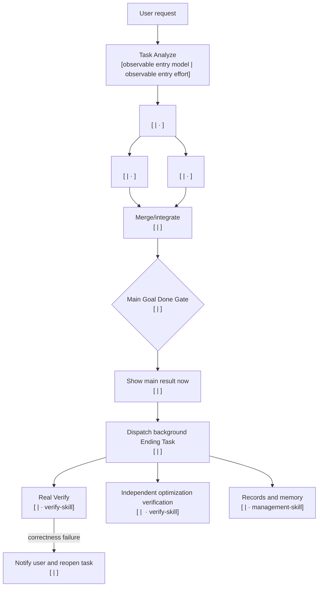

# Task Analyze Route Contract

## First Result Principle

Finish the requested task. For code, run one bounded producer Quick Check before presentation (the Mini Test): a smallest safe local smoke for light work, or syntax and changed-name/reference checks when the real path is API-heavy, large-file, expensive, destructive, or side-effect-heavy. Do not run Mini/Fast Verify before first presentation beyond that bounded check; show the completed result immediately afterward. The separate persistent `End Task-{concise related task name}` thread is a <=60-second read-only handoff audit, not a broader regression, API, or repair worker. Link it and return without waiting; concurrent state change means terminal BLOCKED and exit, never a user question; its terminal verdict is recorded automatically.

## Ordinary Entry Contract

The hookless always-loaded bootstrap, not this full skill, owns ordinary work. Eligible text/code production calls `obsidian_adaptive_model_runner.py` exactly once even on cold start, so a real receipt can be learned after Ending. The runner normally uses one producer. An explicit list of two or three independent read-only sources first records byte metadata and cost-admits one producer versus a graph. Sources within the saved single-producer budget remain one contextual quality session; context pressure or an explicit parallel-latency contract may admit disjoint source nodes plus an adaptive merge. Exact-owned three-source graphs fuse the last source audit into that merge. Tool-only and image/mixed work stays inline. Other exact read-only work stays inline. Neither path adds foreground verification; Ending Real begins only after presentation.

- One obvious reversible action uses one tool action and presents the observed result immediately.
- Exact-scoped read-only work stays inline with no subagent or route. An exact named-source audit first runs one bounded `rg` per authoritative file for every exact user-named target and direct definition, then answers once. Anchor named members directly; enclosing-class or call-site anchors, guessed identifier families, separate planning, broad searches, whole-file reads, rereads, and pre-result checks are forbidden. Present immediately.
- An exact bounded multi-file allowlist uses one boundary-labelled broad search, not parallel agents, separate locator/read rounds, or one full read per file.
- Requested text/code production uses the smallest adaptive producer surface. Code runs one proportional Quick Check before presentation; heavy integration, API, build, render, or state verification runs only when the user explicitly requests it. Detached Ending Real only checks the handoff/receipt and records its terminal verdict automatically.
- A dependency-coupled task that merely appears complex still avoids multi-node routing unless the user explicitly asks for routing/benchmarking/maintenance or current comparable evidence positively admits a graph. It keeps the single adaptive producer. Independent sources remain one producer unless the byte/context or explicit latency gate admits scheduling.

The graduated examples are therefore inline by default:

- Open Chrome: perform the action, present completion, then verify state in Ending Real.
- Open Chrome and open YouTube: perform the action, present completion, then verify `youtube.com` in Ending Real.
- Open Chrome, open YouTube, and search CCTV: perform the action, present completion, then inspect the query/results in Ending Real.
- Design a website like YouTube: use one adaptive producer, present the completed draft, then run render and interaction checks in Ending Real. Apparent complexity alone does not create a dispatcher.

## Explicit Or Admitted Foreground Budget

Load full Task Analyze only for explicit model routing/benchmarking, Task Analyze maintenance, or a real dependency graph under consideration. Full activation still defaults to one adaptive producer or inline ineligible work. An open-ended multi-node foreground exists only after comparable end-to-end evidence positively admits it. The independent-source candidate is bounded by byte/context or explicit latency admission, disjoint allowlists, read-only execution, and either a dependency-results-only merge or one exact-owned final source fused with the merge; current matched evidence is still required before claiming savings.

For an admitted route, the entry model may coordinate the route but must not duplicate a child's source inspection. Every collaboration child starts with `LOCKED_ROUTE_NODE`, and collaboration plus dispatcher must never execute the same branch twice.

- One admitted deterministic model node uses one producer, immediate result release, and post-result Real Verify.
- Multiple result branches require pairwise-disjoint `source_allowlist` values. The main merge either sets `reads_dependency_results_only=true` with no source allowlist, or sets `fuses_owned_source_with_dependencies=true` with exactly one additional disjoint source allowlist and direct dependencies on every other result node.
- Plans set `first_result_timeout_seconds` (normally 180 seconds for bounded work and 600 seconds for a complex graph). Deadline exhaustion stops foreground execution and preserves partial evidence.
- A buffered admitted entry process returns as soon as the result is complete with Ending pending; Real Verify never delays that return.

## Extension Guide

For full extension steps, use [`router-extension-guide`](router-extension-guide.md).

A code-domain extension follows the single registry seam in [`router-extension-guide`](router-extension-guide.md): one `EXECUTION_DOMAINS` row, one executor reference, and generic registry-driven tests. Current examples are `python`, `csharp`, and `unity_csharp`; `code_unspecified` is migration/history-only. Keep language rules in executor references, not registry metadata. Additive values do not require a schema bump.

## Admitted Single Node: Text Route

Show this compact route only after full Task Analyze was explicitly activated and positive performance admission selected one delegated node. Do not draw Mermaid for one admitted node:

```text
Task: <result> — admitted single node
Route: Task Analyze [<observable entry model ID> | <observable entry effort> · task-analyze-skill] -> <direct task> [<model ID> | <effort> · <installed skill>] -> Show main result immediately -> Ending Task Real Verify [<model ID> | <effort> · verify-skill]
Why this route is admitted: <one sentence naming current comparable end-to-end evidence>
```

During the admitted preflight call `resolve_entry_model.py`; use `unverified` only when exact entry resolution fails. After showing the route, continue through Workflow and return the requested result in the same task. If admission is absent, execute inline with no route display.

## Admitted Complex Graph: Mermaid Route

Use this only for an explicitly activated, positively admitted dependency graph. Show real dependencies and concurrency. Label every model-executed node with exact model and effort; direct tool-only nodes name their installed skill and observable stop condition instead.



Follow the diagram with a numbered `Workflow with models` list. Each item names the purpose, exact model ID, effort, owning installed skill, dependencies, and stop condition.

After the admitted route is visible, continue through Workflow. Do not stop merely because the route is complete.

## Internal Plan

The user sees only the human route. A structured plan is an internal execution artifact, never conversation output.

When a dispatcher is useful, save schema version 2 JSON inside the active task cache with:

- `complexity` and `topology`;
- an absolute cache directory inside the active task root;
- observable entry metadata;
- bounded result and Ending nodes;
- installed skill, exact model, effort, dependencies, prompt, safe sandbox, and routing profile per node;
- main-producer `model_memory_scope` with module plus file/symbol/code/operation when known; omitted file/symbol values intentionally fall back to module-level project evidence;
- `main_result_node` and one post-result Real verifier.

The internal main producer carries a complete `routing_recommendation` matching its selected catalog-derived quality `model|effort`, `trial`, and profile fingerprint. The controller recomputes it and rejects stale or self-authored plans. The optional schedule producer is never an ordinary schema-version-2 quality node; the dispatcher admits it only for disjoint one-source read-only branches and records every branch pair in the schedule receipt.

The plan also carries `first_result_timeout_seconds`. Dispatcher stdout is a compact locator only; the full manifest remains on disk. Read-only locked nodes omit broad user configuration by default because their prompt already includes the exact owning skill path and domain reference; set `load_user_config=true` only when a configured plugin/tool surface is genuinely required.

Invoke `scripts/task_route_dispatcher.py run-plan <plan-file>`. The dispatcher executes only result nodes before release. After the main result is shown, invoke its Ending handoff separately so Real Verify and records remain post-result work.

## Plan-Lock Invariants

Admitted dispatcher fixtures are topology-only portable templates, not execution authorization: materialization injects only the active cache directory and observed entry model|effort, then the real dispatcher validator runs them for every supported entry pair. Ordinary graduated fixtures remain inline and contain no dispatcher plan. Current positive performance admission plus a fresh frozen recommendation is still required before open-ended execution. A runner-generated independent-source plan must retain its cost-admission receipt, source-count, disjointness, read-only, and dependency-only-or-fused-final merge gates. Downstream node pairs, dependencies, roles, adaptive producer, Ending checks, and controller transitions remain fixture-controlled only inside admitted templates.

- Task Analyze appears first only in the human route for explicitly activated work and uses the selected entry pair; schema-version-2 dispatcher nodes begin with result work and carry entry metadata separately.
- Bounded preflight resolves that pair with `resolve_entry_model.py`; no fixed entry model is implied.
- The current pair performs ordinary inline work. In an admitted route, downstream nodes use their locked pairs rather than silently inheriting the entry pair.
- Every downstream model and effort is supported and receipt-backed when execution proof is required.
- Every owning skill is installed.
- Active registry-owned code-domain implementation and authored probes use `code-skill`. Plan nodes and ordinary fallbacks use the generated quality ladder; ordinary text/code result producers execute the contextual quality recommendation directly.
- Main Result is upstream of Ending Task.
- Ending Real Verify, optimization verification, reports, logs, docs, and memory do not gate the first result.
- Optional related-memory preflight is read-only, bounded, and advisory. An unavailable provider or no matches never blocks routing. Ending updates only related sanitized memory after the result; claude-model-switch memory waits for Real Verify.
- The main producer carries a complete Obsidian-derived `routing_recommendation` proof matching its selected pair, trial flag, and profile fingerprint. Bind its receipt to `ending_task_ledger.py start`; the terminal event records model-quality learning through `project-memory-skill/scripts/obsidian_model_memory.py`. Tool-only routes never record adaptive producer samples, verifier models are never recorded as producers, and deterministic controller recording needs no decorative model call.
- A later correctness failure notifies and reopens.
- No lifecycle hook or chat-visible machine plan is required.
- Ending wave scheduling requires dependency-ready batches with a three-node concurrency cap.
- Grounded low-risk text-answer plans use one result node unless disjoint source allowlists plus a dependency-only or exact-owned fused-final merge prove non-duplicated fan-out.
- First-result deadline gates every foreground wave and fallback. Deadline exhaustion cannot launch another plan.
- For Ending Task, each `optimization-skill` node must have exactly one `verify-skill` ending node with `verifies_node` equal to that optimization node ID.
- A targeted optimization verifier must depend directly on Main Result and on its target node; only this verifier may depend on another Ending node.
- Targeted optimizer verifiers must carry explicit `verifies_node`, use a distinct sanitized worker identity from target, and fail when identities are missing or equal.
- Worker identity is `SHA-256(thread_id)`; raw thread IDs are never stored in dispatch manifests.
- Direct-action timings use external wall-clock-to-stop evidence. Complex timing/token claims require passing runtime receipts, and savings claims require like-for-like repeated baselines.
